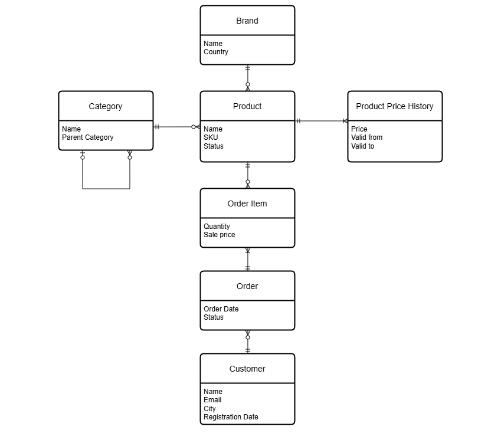
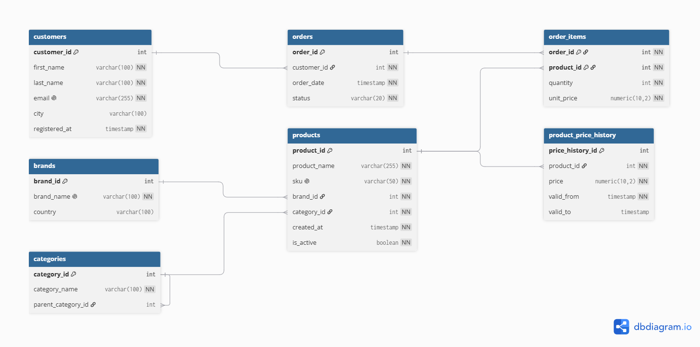
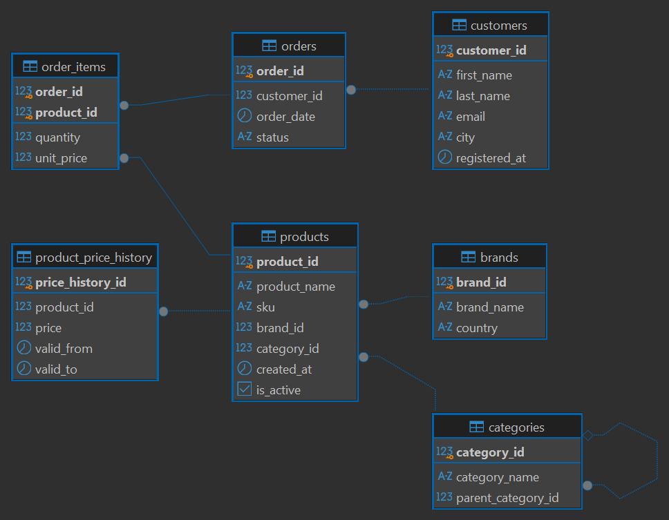

# Music Gear Store Database

Учебный pet-проект по проектированию и реализации базы данных интернет-магазина музыкальных инструментов в PostgreSQL.

Проект включает концептуальную, логическую и физическую модели, DDL/DML-скрипты, аналитические SQL-запросы, индексы, представления, процедуры и транзакции.

## О проекте

База данных предназначена для хранения информации о:

- покупателях;
- брендах;
- категориях товаров;
- товарах;
- заказах;
- позициях заказов;
- истории изменения цен.

Категории товаров имеют иерархическую структуру.
Например:

Musical Instruments
→ Guitars
→ Electric Guitars

Для хранения истории изменения цен используется SCD Type 2.

## Структура базы данных

В проекте используются 7 таблиц:

- customers - покупатели;
- brands - бренды;
- categories - категории товаров;
- products - товары;
- orders - заказы;
- order_items - позиции заказов;
- product_price_history - история изменения цен.

Связь между orders и products реализована через таблицу order_items.

Таблица categories содержит ссылку на саму себя через
parent_category_id, что позволяет хранить дерево категорий.

Таблица product_price_history хранит несколько версий цены
для одного товара.

## Модели данных

Концептуальная модель:

Логическая модель:

Физическая модель:

## Описание физической модели
## customers

| Поле | Тип | Ограничения |
|---|---|---|
| customer_id | serial | primary key |
| first_name | varchar(100) | not null |
| last_name | varchar(100) | not null |
| email | varchar(255) | unique, not null |
| city | varchar(100) | |
| registered_at | timestamp | not null, default current_timestamp |

## brands

| Поле | Тип | Ограничения |
|---|---|---|
| brand_id | serial | primary key |
| brand_name | varchar(100) | unique, not null |
| country | varchar(100) | |

## categories

| Поле | Тип | Ограничения |
|---|---|---|
| category_id | serial | primary key |
| category_name | varchar(100) | not null |
| parent_category_id | integer | foreign key → categories(category_id) |

Поле parent_category_id позволяет хранить иерархию категорий.
Для корневых категорий оно равно NULL.

## products

| Поле | Тип | Ограничения |
|---|---|---|
| product_id | serial | primary key |
| product_name | varchar(255) | not null |
| sku | varchar(50) | unique, not null |
| brand_id | integer | foreign key → brands |
| category_id | integer | foreign key → categories |
| created_at | timestamp | default current_timestamp |
| is_active | boolean | default true |

## orders

| Поле | Тип | Ограничения |
|---|---|---|
| order_id | serial | primary key |
| customer_id | integer | foreign key → customers |
| order_date | timestamp | default current_timestamp |
| status | varchar(20) | not null, check |

Допустимые статусы:

- new;
- paid;
- shipped;
- completed;
- cancelled.

## order_items

| Поле | Тип | Ограничения |
|---|---|---|
| order_id | integer | foreign key → orders |
| product_id | integer | foreign key → products |
| quantity | integer | not null, check > 0 |
| unit_price | numeric(10,2) | not null, check >= 0 |

Первичный ключ составной:

`(order_id, product_id)`.

Таблица реализует связь многие-ко-многим
между orders и products.

## product_price_history

| Поле | Тип | Ограничения |
|---|---|---|
| price_history_id | serial | primary key |
| product_id | integer | foreign key → products |
| price | numeric(10,2) | not null, check > 0 |
| valid_from | timestamp | not null |
| valid_to | timestamp | |

Таблица используется для хранения истории изменения цен по SCD Type 2.

Если valid_to равно NULL, версия цены считается текущей.

## Сценарии использования 

Для запуска проекта необходимо создать пустую PostgreSQL-базу данных
и выполнить SQL-файлы в следующем порядке:

1. `01_create_tables.sql`
2. `02_insert_brands.sql`
3. `03_insert_categories.sql`
4. `04_insert_customers.sql`
5. `05_insert_products.sql`
6. `06_insert_product_price_history.sql`
7. `07_insert_orders.sql`
8. `08_insert_order_items.sql`
9. `10_queries.sql`
10. `11_indexes.sql`
11. `12_views.sql`
12. `13_procedures.sql`
13. `14_transactions.sql`

Скрипты рассчитаны на запуск в пустой базе данных.

## Подробнее о проекте и соответствии требованиям задания
## Нормализация

Схема приведена к третьей нормальной форме (3NF).
Данные о брендах, категориях, покупателях и товарах хранятся в отдельных таблицах и связываются через внешние ключи.

Например, данные о бренде не дублируются в таблице products.
В products хранится только brand_id, который ссылается на brands.

Связь многие-ко-многим между заказами и товарами реализована через таблицу order_items.

## Версионные данные

Для хранения истории изменения цен используется SCD Type 2.

При изменении цены старая запись не удаляется и не обновляется.
Для нее заполняется valid_to, после чего создается новая строка с новой ценой и новым valid_from.

Если valid_to = NULL, цена считается текущей.
Такой подход позволяет восстановить цену товара на любую дату.

## Данные

Для проекта используется искусственно созданный набор данных.

Количество строк:

- brands - 15;
- categories - 23;
- customers - 40;
- products - 50;
- orders - 100;
- order_items - 250;
- product_price_history - 120.

Данные были созданы с учетом связей между таблицами
и бизнес-логики проекта.

Например:

- заказ не может быть создан раньше регистрации покупателя;
- каждая позиция заказа содержит существующий товар;
- цена в order_items соответствует цене товара на дату заказа;
- у товара может быть несколько исторических цен;
- часть покупателей не имеет заказов;
- часть товаров ни разу не продавалась.

## SQL-запросы

В файле `scripts/10_queries.sql` находятся аналитические запросы.

В них используются:

- WHERE, GROUP BY, HAVING, ORDER BY;
- JOIN (INNER, LEFT, RIGHT, FULL, SELF);
- IN, EXISTS, ANY, ALL;
- подзапросы, оконные функции;
- LIMIT / OFFSET;
- WITH RECURSIVE.

Примеры задач:

- поиск категорий без товаров;
- сравнение регистраций и заказов по месяцам;
- поиск товаров дороже средней цены;
- рейтинг товаров по цене;
- просмотр предыдущей версии цены;
- построение дерева категорий.

## Индексы

В проекте добавлены индексы для часто используемых полей:

- orders(customer_id);
- products(category_id);
- order_items(product_id);
- product_price_history(product_id, valid_from).

Индексы предназначены для ускорения поиска и соединения таблиц при увеличении объема данных.

## Представления

Созданы два представления:

### current_product_prices

Содержит текущую цену каждого товара. Используется для запросов, где не требуется вся история изменения цен.

### order_totals

Содержит рассчитанную сумму каждого заказа. Сумма вычисляется как: quantity * unit_price

## Процедуры

В проекте используются процедуры:

- add_brand - добавление нового бренда;
- add_customer - добавление нового покупателя;
- change_product_price - изменение цены товара с сохранением истории.

## Транзакции

В проекте показан транзакционный сценарий - создание заказа вместе с позициями заказа.
